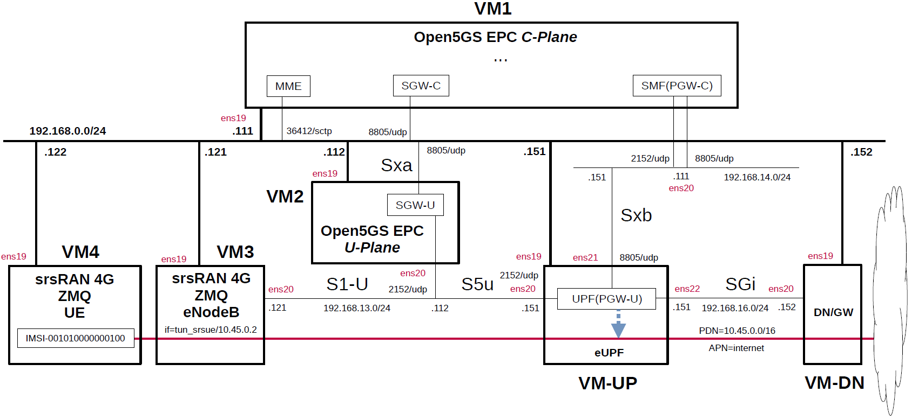

# Open5GS EPC & srsRAN 4G with ZeroMQ UE / RAN Sample Configuration - eUPF(eBPF/XDP UPF(PGW-U))
This describes a simple configuration for working Open5GS EPC and eUPF(eBPF/XDP UPF(PGW-U)).
In particular, see [here](https://github.com/s5uishida/install_eupf) for eUPF.

---

### [Sample Configurations and Miscellaneous for Mobile Network](https://github.com/s5uishida/sample_config_misc_for_mobile_network)

---

<a id="toc"></a>

## Table of Contents

- [Overview of Open5GS CUPS-enabled EPC Simulation Mobile Network](#overview)
- [Changes in configuration files of Open5GS EPC, eUPF and srsRAN 4G ZMQ UE / RAN](#changes)
  - [Changes in configuration files of Open5GS EPC C-Plane](#changes_cp)
  - [Changes in configuration files of Open5GS EPC U-Plane](#changes_up)
  - [Changes in configuration files of eUPF](#changes_eupf)
  - [Changes in configuration files of srsRAN 4G ZMQ UE / RAN](#changes_srs)
    - [Changes in configuration files of RAN](#changes_ran)
    - [Changes in configuration files of UE](#changes_ue)
- [Network settings of Open5GS EPC, eUPF and srsRAN 4G ZMQ UE / RAN](#network_settings)
  - [Network settings of eUPF and Data Network Gateway](#network_settings_up)
- [Build Open5GS, eUPF and srsRAN 4G ZMQ UE / RAN](#build)
- [Run Open5GS EPC, eUPF and srsRAN 4G ZMQ UE / RAN](#run)
  - [Run eUPF](#run_eupf)
  - [Run Open5GS EPC U-Plane](#run_up)
  - [Run Open5GS EPC C-Plane](#run_cp)
  - [Run srsRAN 4G ZMQ RAN](#run_ran)
  - [Run srsRAN 4G ZMQ UE](#run_ue)
- [Ping google.com](#ping)
  - [Case for going through PDN 10.45.0.0/16](#ping_1)
- [Changelog (summary)](#changelog)

<a id="overview"></a>

## Overview of Open5GS CUPS-enabled EPC Simulation Mobile Network

This describes a simple configuration of C-Plane, eUPF and Data Network Gateway for Open5GS EPC.
**Note that this configuration is implemented with Virtualbox VMs.**

The following minimum configuration was set as a condition.
- One SGW-U/UPF(PGW-U) and Data Network Gateway
- One UE and one APN

The built simulation environment is as follows.

</img>

The EPC / eBPF/XDP PGW-U / UE / RAN used are as follows.
- EPC - Open5GS v2.7.0 (2024.03.24) - https://github.com/open5gs/open5gs
- eBPF/XDP PGW-U - eUPF v0.6.1 (2024.01.25) - https://github.com/edgecomllc/eupf
- UE / RAN - srsRAN 4G (2024.02.01) - https://github.com/srsran/srsRAN_4G

Each VMs are as follows.  
| VM | SW & Role | IP address | OS | CPU<br>(Min) | Memory<br>(Min) | HDD<br>(Min) |
| --- | --- | --- | --- | --- | --- | --- |
| VM1 | Open5GS EPC C-Plane | 192.168.0.111/24 | Ubuntu 22.04 | 1 | 2GB | 20GB |
| VM2 | Open5GS EPC U-Plane(SGW-U) | 192.168.0.112/24 | Ubuntu 22.04 | 1 | 1GB | 20GB |
| VM-UP | eUPF U-Plane(PGW-U) | 192.168.0.151/24 | Ubuntu 22.04 | 1 | 2GB | 20GB |
| VM-DN | Data Network Gateway  | 192.168.0.152/24 | Ubuntu 22.04 | 1 | 1GB | 10GB |
| VM3 | srsRAN 4G ZMQ RAN (eNodeB) | 192.168.0.121/24 | Ubuntu 22.04 | 1 | 2GB | 10GB |
| VM4 | srsRAN 4G ZMQ UE | 192.168.0.122/24 | Ubuntu 22.04 | 1 | 2GB | 10GB |

The network interfaces of each VM are as follows.
| VM | Device | Network Adapter | IP address | Interface | XDP |
| --- | --- | --- | --- | --- | --- |
| VM1 | enp0s3 | NAT(default) | 10.0.2.15/24 | (VM default NW) | -- |
| | enp0s8 | Bridged Adapter | 192.168.0.111/24 | (Mgmt NW) | -- |
| | enp0s9 | NAT Network | 192.168.14.111/24 | Sxb (N4 for 5GC) | -- |
| VM2 | enp0s3 | NAT(default) | 10.0.2.15/24 | (VM default NW) | -- |
| | enp0s8 | Bridged Adapter | 192.168.0.112/24 | (Mgmt NW) | -- |
| | enp0s9 | NAT Network | 192.168.13.112/24 | S1-U,S5u (N3 for 5GC) | -- |
| VM-UP | ~~enp0s3~~ | ~~NAT(default)~~ | ~~10.0.2.15/24~~ | ~~(VM default NW)~~ ***down*** | -- |
| | enp0s8 | Bridged Adapter | 192.168.0.151/24 | (Mgmt NW) | -- |
| | enp0s9 | NAT Network | 192.168.13.151/24 | S5u (N3 for 5GC) | x |
| | enp0s10 | NAT Network | 192.168.14.151/24 | Sxb (N4 for 5GC) | -- |
| | enp0s16 | NAT Network | 192.168.16.151/24 | SGi (N6 for 5GC) | x |
| VM-DN | enp0s3 | NAT(default) | 10.0.2.15/24 | (VM default NW) | -- |
| | enp0s8 | Bridged Adapter | 192.168.0.152/24 | (Mgmt NW) | -- |
| | enp0s9 | NAT Network | 192.168.16.152/24 | SGi (N6 for 5GC),<br>***default GW for VM-UP*** | -- |
| VM3 | enp0s3 | NAT(default) | 10.0.2.15/24 | (VM default NW) | -- |
| | enp0s8 | Bridged Adapter | 192.168.0.121/24 | (Mgmt NW) | -- |
| | enp0s9 | NAT Network | 192.168.13.121/24 | S1-U (N3 for 5GC) | -- |
| VM4 | enp0s3 | NAT(default) | 10.0.2.15/24 | (VM default NW) | -- |
| | enp0s8 | Bridged Adapter | 192.168.0.122/24 | (Mgmt NW) | -- |

NAT networks of Virtualbox  are as follows.
| Network Name | Network CIDR | Note |
| --- | --- | --- |
| N3 | 192.168.13.0/24 | S1-U,S5u for EPC |
| N4 | 192.168.14.0/24 | Sxb for EPC |
| N6 | 192.168.16.0/24 | SGi for EPC |

Subscriber Information (other information is the same) is as follows.  
| UE | IMSI | APN | OP/OPc |
| --- | --- | --- | --- |
| UE | 001010000000100 | internet | OPc |

I registered these information with the Open5GS WebUI.
In addition, [3GPP TS 35.208](https://www.3gpp.org/DynaReport/35208.htm) "4.3 Test Sets" is published by 3GPP as test data for the 3GPP authentication and key generation functions (MILENAGE).

The PDN is as follows.
| PDN | APN | TUNnel interface of UE |
| --- | --- | --- |
| 10.45.0.0/16 | internet | tun_srsue |

The main information of eNodeB is as follows.
| MCC | MNC | TAC | eNodeB ID | Cell ID | E-UTRAN Cell ID |
| --- | --- | --- | --- | --- | --- |
| 001 | 01 | 1 | 0x19b | 0x01 | 0x19b01 |

<a id="changes"></a>

## Changes in configuration files of Open5GS EPC, eUPF and srsRAN 4G ZMQ UE / RAN

Please refer to the following for building Open5GS, eUPF and srsRAN 4G ZMQ respectively.
- Open5GS v2.7.0 (2024.03.24) - https://open5gs.org/open5gs/docs/guide/02-building-open5gs-from-sources/
- eUPF v0.6.1 (2024.01.25) - https://github.com/s5uishida/install_eupf
- srsRAN 4G (2024.02.01) - https://github.com/s5uishida/build_srsran_4g_zmq_disable_rf_plugins

<a id="changes_cp"></a>

### Changes in configuration files of Open5GS EPC C-Plane

The following parameters can be used in the logic that selects SGW-U and UPF(PGW-U) as the connection destination by PFCP.

- APN
- TAC (Tracking Area Code)
- e_CellID

For the sake of simplicity, I used only APN this time.

- `open5gs/install/etc/open5gs/mme.yaml`
```diff
--- mme.yaml.orig       2024-03-24 15:36:48.000000000 +0900
+++ mme.yaml    2024-03-24 22:45:30.234769981 +0900
@@ -11,7 +11,7 @@
   freeDiameter: /root/open5gs/install/etc/freeDiameter/mme.conf
   s1ap:
     server:
-      - address: 127.0.0.2
+      - address: 192.168.0.111
   gtpc:
     server:
       - address: 127.0.0.2
@@ -26,14 +26,14 @@
         port: 9090
   gummei:
     - plmn_id:
-        mcc: 999
-        mnc: 70
+        mcc: 001
+        mnc: 01
       mme_gid: 2
       mme_code: 1
   tai:
     - plmn_id:
-        mcc: 999
-        mnc: 70
+        mcc: 001
+        mnc: 01
       tac: 1
   security:
     integrity_order : [ EIA2, EIA1, EIA0 ]
```
- `open5gs/install/etc/open5gs/sgwc.yaml`
```diff
--- sgwc.yaml.orig      2024-03-24 15:36:48.000000000 +0900
+++ sgwc.yaml   2024-03-24 22:45:54.437378657 +0900
@@ -13,10 +13,11 @@
       - address: 127.0.0.3
   pfcp:
     server:
-      - address: 127.0.0.3
+      - address: 192.168.0.111
     client:
       sgwu:
-        - address: 127.0.0.6
+        - address: 192.168.0.112
+          apn: internet
 
 ################################################################################
 # GTP-C Server
```
- `open5gs/install/etc/open5gs/smf.yaml`
```diff
--- smf.yaml.orig       2024-03-24 15:36:48.000000000 +0900
+++ smf.yaml    2024-03-25 00:10:24.030693017 +0900
@@ -8,39 +8,29 @@
 #    peer: 64
 
 smf:
-  sbi:
-    server:
-      - address: 127.0.0.4
-        port: 7777
-    client:
-#      nrf:
-#        - uri: http://127.0.0.10:7777
-      scp:
-        - uri: http://127.0.0.200:7777
   pfcp:
     server:
-      - address: 127.0.0.4
+      - address: 192.168.14.111
     client:
       upf:
-        - address: 127.0.0.7
+        - address: 192.168.14.151
+          dnn: internet
   gtpc:
     server:
       - address: 127.0.0.4
   gtpu:
     server:
-      - address: 127.0.0.4
+      - address: 192.168.14.111
   metrics:
     server:
       - address: 127.0.0.4
         port: 9090
   session:
     - subnet: 10.45.0.1/16
-    - subnet: 2001:db8:cafe::1/48
+      dnn: internet
   dns:
     - 8.8.8.8
     - 8.8.4.4
-    - 2001:4860:4860::8888
-    - 2001:4860:4860::8844
   mtu: 1400
 #  p-cscf:
 #    - 127.0.0.1
```

<a id="changes_up"></a>

### Changes in configuration files of Open5GS EPC U-Plane

- `open5gs/install/etc/open5gs/sgwu.yaml`
```diff
--- sgwu.yaml.orig      2024-03-24 15:36:48.000000000 +0900
+++ sgwu.yaml   2024-03-24 22:41:40.582500287 +0900
@@ -10,13 +10,13 @@
 sgwu:
   pfcp:
     server:
-      - address: 127.0.0.6
+      - address: 192.168.0.112
     client:
 #      sgwc:    # SGW-U PFCP Client try to associate SGW-C PFCP Server
 #        - address: 127.0.0.3
   gtpu:
     server:
-      - address: 127.0.0.6
+      - address: 192.168.13.112
 
 ################################################################################
 # PFCP Server
```

<a id="changes_eupf"></a>

### Changes in configuration files of eUPF

See [here](https://github.com/s5uishida/install_eupf#create-configuration-file) for the original files.

- `eupf/config.yml`  
There is no change.

<a id="changes_srs"></a>

### Changes in configuration files of srsRAN 4G ZMQ UE / RAN

<a id="changes_ran"></a>

#### Changes in configuration files of RAN

- `srsRAN_4G/build/srsenb/enb.conf`
```diff
--- enb.conf.example    2024-02-03 23:26:02.000000000 +0900
+++ enb.conf    2024-03-10 17:00:27.383907337 +0900
@@ -22,9 +22,9 @@
 enb_id = 0x19B
 mcc = 001
 mnc = 01
-mme_addr = 127.0.1.100
-gtp_bind_addr = 127.0.1.1
-s1c_bind_addr = 127.0.1.1
+mme_addr = 192.168.0.111
+gtp_bind_addr = 192.168.13.121
+s1c_bind_addr = 192.168.0.121
 s1c_bind_port = 0
 n_prb = 50
 #tm = 4
@@ -80,8 +80,8 @@
 #time_adv_nsamples = auto
 
 # Example for ZMQ-based operation with TCP transport for I/Q samples
-#device_name = zmq
-#device_args = fail_on_disconnect=true,tx_port=tcp://*:2000,rx_port=tcp://localhost:2001,id=enb,base_srate=23.04e6
+device_name = zmq
+device_args = fail_on_disconnect=true,tx_port=tcp://192.168.0.121:2000,rx_port=tcp://192.168.0.122:2001,id=enb,base_srate=23.04e6
 
 #####################################################################
 # Packet capture configuration
```
- `srsRAN_4G/build/srsenb/rr.conf`
```diff
--- rr.conf.example     2024-02-03 23:26:02.000000000 +0900
+++ rr.conf     2023-05-02 11:52:54.000000000 +0900
@@ -55,7 +55,7 @@
   {
     // rf_port = 0;
     cell_id = 0x01;
-    tac = 0x0007;
+    tac = 0x0001;
     pci = 1;
     // root_seq_idx = 204;
     dl_earfcn = 3350;
```

<a id="changes_ue"></a>

#### Changes in configuration files of UE

- `srsRAN_4G/build/srsue/ue.conf`
```diff
--- ue.conf.example     2024-02-03 23:26:02.000000000 +0900
+++ ue.conf     2023-05-02 12:01:28.000000000 +0900
@@ -42,8 +42,8 @@
 #continuous_tx     = auto
 
 # Example for ZMQ-based operation with TCP transport for I/Q samples
-#device_name = zmq
-#device_args = tx_port=tcp://*:2001,rx_port=tcp://localhost:2000,id=ue,base_srate=23.04e6
+device_name = zmq
+device_args = tx_port=tcp://192.168.0.122:2001,rx_port=tcp://192.168.0.121:2000,id=ue,base_srate=23.04e6
 
 #####################################################################
 # EUTRA RAT configuration
@@ -139,9 +139,9 @@
 [usim]
 mode = soft
 algo = milenage
-opc  = 63BFA50EE6523365FF14C1F45F88737D
-k    = 00112233445566778899aabbccddeeff
-imsi = 001010123456780
+opc  = E8ED289DEBA952E4283B54E88E6183CA
+k    = 465B5CE8B199B49FAA5F0A2EE238A6BC
+imsi = 001010000000100
 imei = 353490069873319
 #reader =
 #pin  = 1234
@@ -180,8 +180,8 @@
 #                      Supported: 0 - NULL, 1 - Snow3G, 2 - AES, 3 - ZUC
 #####################################################################
 [nas]
-#apn = internetinternet
-#apn_protocol = ipv4
+apn = internet
+apn_protocol = ipv4
 #user = srsuser
 #pass = srspass
 #force_imsi_attach = false
```

<a id="network_settings"></a>

## Network settings of Open5GS 5GC, eUPF and srsRAN 4G ZMQ UE / RAN

<a id="network_settings_up"></a>

### Network settings of eUPF and Data Network Gateway

See [this1](https://github.com/s5uishida/install_eupf#setup-eupf-on-vm-up) and [this2](https://github.com/s5uishida/install_eupf#setup-data-network-gateway-on-vm-dn).

<a id="build"></a>

## Build Open5GS, eUPF and srsRAN 4G ZMQ UE / RAN

Please refer to the following for building Open5GS, eUPF and srsRAN 4G ZMQ UE / RAN respectively.
- Open5GS v2.7.0 (2024.03.24) - https://open5gs.org/open5gs/docs/guide/02-building-open5gs-from-sources/
- eUPF v0.6.1 (2024.01.25)- https://github.com/s5uishida/install_eupf
- srsRAN 4G (2024.02.01) - https://github.com/s5uishida/build_srsran_4g_zmq_disable_rf_plugins

Install MongoDB on Open5GS EPC C-Plane machine.
[MongoDB Compass](https://www.mongodb.com/products/compass) is a convenient tool to look at the MongoDB database.

<a id="run"></a>

## Run Open5GS EPC, eUPF and srsRAN 4G ZMQ UE / RAN

First run eUPF and EPC U-Plane(SGW-U), then EPC C-Plane, the RAN, and the UE.

<a id="run_eupf"></a>

### Run eUPF

See [this](https://github.com/s5uishida/install_eupf#run-eupf-on-vm-up).

<a id="run_up"></a>

### Run Open5GS EPC U-Plane

```
./install/bin/open5gs-sgwud &
```

<a id="run_cp"></a>

### Run Open5GS EPC C-Plane

```
./install/bin/open5gs-mmed &
./install/bin/open5gs-sgwcd &
./install/bin/open5gs-smfd &
./install/bin/open5gs-hssd &
./install/bin/open5gs-pcrfd &
```
The PFCP association log between eUPF and Open5GS SMF is as follows.
```
2024/03/24 23:59:47 INF Got Association Setup Request from: 192.168.14.111. 

2024/03/24 23:59:47 INF 
Association Setup Request:
  Node ID: 192.168.14.111
  Recovery Time: 2024-03-24 23:59:47 +0900 JST

2024/03/24 23:59:47 INF Saving new association: &{ID:192.168.14.111 Addr:192.168.14.111 NextSessionID:1 NextSequenceID:1 Sessions:map[] HeartbeatChannel:0xc00057e000 FailedHeartbeats:0 HeartbeatsActive:false Mutex:{state:0 sema:0}}
```

<a id="run_ran"></a>

### Run srsRAN 4G ZMQ RAN

Run srsRAN 4G ZMQ RAN and connect to Open5GS EPC.
```
# cd srsRAN_4G/build/srsenb
# ./src/srsenb enb.conf
---  Software Radio Systems LTE eNodeB  ---

Reading configuration file enb.conf...

Built in Release mode using commit ec29b0c1f on branch master.

Opening 1 channels in RF device=zmq with args=fail_on_disconnect=true,tx_port=tcp://192.168.0.121:2000,rx_port=tcp://192.168.0.122:2001,id=enb,base_srate=23.04e6
Supported RF device list: zmq file
CHx base_srate=23.04e6
CHx id=enb
Current sample rate is 1.92 MHz with a base rate of 23.04 MHz (x12 decimation)
CH0 rx_port=tcp://192.168.0.122:2001
CH0 tx_port=tcp://192.168.0.121:2000
CH0 fail_on_disconnect=true

==== eNodeB started ===
Type <t> to view trace
Current sample rate is 11.52 MHz with a base rate of 23.04 MHz (x2 decimation)
Current sample rate is 11.52 MHz with a base rate of 23.04 MHz (x2 decimation)
Setting frequency: DL=2680.0 Mhz, UL=2560.0 MHz for cc_idx=0 nof_prb=50
```
The Open5GS C-Plane log when executed is as follows.
```
03/25 00:00:16.580: [mme] INFO: eNB-S1 accepted[192.168.0.121]:44139 in s1_path module (../src/mme/s1ap-sctp.c:114)
03/25 00:00:16.580: [mme] INFO: eNB-S1 accepted[192.168.0.121] in master_sm module (../src/mme/mme-sm.c:108)
03/25 00:00:16.580: [mme] INFO: [Added] Number of eNBs is now 1 (../src/mme/mme-context.c:2829)
03/25 00:00:16.580: [mme] INFO: eNB-S1[192.168.0.121] max_num_of_ostreams : 30 (../src/mme/mme-sm.c:150)
```

<a id="run_ue"></a>

### Run srsRAN 4G ZMQ UE

Run srsRAN 4G ZMQ UE and connect to Open5GS EPC.
```
# cd srsRAN_4G/build/srsue
# ./src/srsue ue.conf
Reading configuration file ue.conf...

Built in Release mode using commit ec29b0c1f on branch master.

Opening 1 channels in RF device=zmq with args=tx_port=tcp://192.168.0.122:2001,rx_port=tcp://192.168.0.121:2000,id=ue,base_srate=23.04e6
Supported RF device list: zmq file
CHx base_srate=23.04e6
CHx id=ue
Current sample rate is 1.92 MHz with a base rate of 23.04 MHz (x12 decimation)
CH0 rx_port=tcp://192.168.0.121:2000
CH0 tx_port=tcp://192.168.0.122:2001
Waiting PHY to initialize ... done!
Attaching UE...
Current sample rate is 1.92 MHz with a base rate of 23.04 MHz (x12 decimation)
Current sample rate is 1.92 MHz with a base rate of 23.04 MHz (x12 decimation)
.
Found Cell:  Mode=FDD, PCI=1, PRB=50, Ports=1, CP=Normal, CFO=-0.2 KHz
Current sample rate is 11.52 MHz with a base rate of 23.04 MHz (x2 decimation)
Current sample rate is 11.52 MHz with a base rate of 23.04 MHz (x2 decimation)
Found PLMN:  Id=00101, TAC=1
Random Access Transmission: seq=40, tti=181, ra-rnti=0x2
RRC Connected
Random Access Complete.     c-rnti=0x46, ta=0
Network attach successful. IP: 10.45.0.2
 nTp) ((t) 24/3/2024 15:0:50 TZ:99
```
The Open5GS C-Plane log when executed is as follows.
```
03/25 00:00:50.191: [mme] INFO: InitialUEMessage (../src/mme/s1ap-handler.c:406)
03/25 00:00:50.191: [mme] INFO: [Added] Number of eNB-UEs is now 1 (../src/mme/mme-context.c:4735)
03/25 00:00:50.191: [mme] INFO: Unknown UE by S_TMSI[G:2,C:1,M_TMSI:0xc000033a] (../src/mme/s1ap-handler.c:485)
03/25 00:00:50.191: [mme] INFO:     ENB_UE_S1AP_ID[1] MME_UE_S1AP_ID[1] TAC[1] CellID[0x19b01] (../src/mme/s1ap-handler.c:585)
03/25 00:00:50.191: [mme] INFO: Unknown UE by GUTI[G:2,C:1,M_TMSI:0xc000033a] (../src/mme/mme-context.c:3586)
03/25 00:00:50.191: [mme] INFO: [Added] Number of MME-UEs is now 1 (../src/mme/mme-context.c:3379)
03/25 00:00:50.191: [emm] INFO: [] Attach request (../src/mme/emm-sm.c:423)
03/25 00:00:50.191: [emm] INFO:     GUTI[G:2,C:1,M_TMSI:0xc000033a] IMSI[Unknown IMSI] (../src/mme/emm-handler.c:236)
03/25 00:00:50.234: [emm] INFO: Identity response (../src/mme/emm-sm.c:393)
03/25 00:00:50.234: [emm] INFO:     IMSI[001010000000100] (../src/mme/emm-handler.c:428)
03/25 00:00:50.366: [mme] INFO: [Added] Number of MME-Sessions is now 1 (../src/mme/mme-context.c:4749)
03/25 00:00:50.447: [sgwc] INFO: [Added] Number of SGWC-UEs is now 1 (../src/sgwc/context.c:239)
03/25 00:00:50.448: [sgwc] INFO: [Added] Number of SGWC-Sessions is now 1 (../src/sgwc/context.c:882)
03/25 00:00:50.448: [sgwc] INFO: UE IMSI[001010000000100] APN[internet] (../src/sgwc/s11-handler.c:239)
03/25 00:00:50.448: [gtp] INFO: gtp_connect() [127.0.0.4]:2123 (../lib/gtp/path.c:60)
03/25 00:00:50.449: [smf] INFO: [Added] Number of SMF-UEs is now 1 (../src/smf/context.c:1019)
03/25 00:00:50.449: [smf] INFO: [Added] Number of SMF-Sessions is now 1 (../src/smf/context.c:3090)
03/25 00:00:50.449: [smf] INFO: UE IMSI[001010000000100] APN[internet] IPv4[10.45.0.2] IPv6[] (../src/smf/s5c-handler.c:275)
03/25 00:00:50.453: [gtp] INFO: gtp_connect() [192.168.13.151]:2152 (../lib/gtp/path.c:60)
03/25 00:00:50.778: [emm] INFO: [001010000000100] Attach complete (../src/mme/emm-sm.c:1384)
03/25 00:00:50.778: [emm] INFO:     IMSI[001010000000100] (../src/mme/emm-handler.c:275)
03/25 00:00:50.779: [emm] INFO:     UTC [2024-03-24T15:00:50] Timezone[0]/DST[0] (../src/mme/emm-handler.c:281)
03/25 00:00:50.779: [emm] INFO:     LOCAL [2024-03-25T00:00:50] Timezone[32400]/DST[0] (../src/mme/emm-handler.c:285)
```
The Open5GS U-Plane log when executed is as follows.
```
03/25 00:00:50.369: [sgwu] INFO: UE F-SEID[UP:0xf2a CP:0x200] (../src/sgwu/context.c:171)
03/25 00:00:50.369: [sgwu] INFO: [Added] Number of SGWU-Sessions is now 1 (../src/sgwu/context.c:176)
03/25 00:00:50.374: [gtp] INFO: gtp_connect() [192.168.13.151]:2152 (../lib/gtp/path.c:60)
03/25 00:00:50.701: [gtp] INFO: gtp_connect() [192.168.13.121]:2152 (../lib/gtp/path.c:60)
```
The PDU session establishment log of eUPF is as follows.
```
2024/03/25 00:00:50 INF Got Session Establishment Request from: 192.168.14.111.
2024/03/25 00:00:50 INF 
Session Establishment Request:
  CreatePDR ID: 1 
    FAR ID: 1 
    QER ID: 1 
    Source Interface: 1 
    UE IPv4 Address: 10.45.0.2 
  CreatePDR ID: 2 
    Outer Header Removal: 0 
    FAR ID: 2 
    QER ID: 1 
    Source Interface: 0 
    TEID: 0 
    Ipv4: <nil> 
    Ipv6: <nil> 
    UE IPv4 Address: 10.45.0.2 
  CreatePDR ID: 3 
    Outer Header Removal: 0 
    FAR ID: 1 
    Source Interface: 3 
    TEID: 0 
    Ipv4: <nil> 
    Ipv6: <nil> 
  CreatePDR ID: 4 
    Outer Header Removal: 0 
    FAR ID: 3 
    Source Interface: 0 
    TEID: 0 
    Ipv4: <nil> 
    Ipv6: <nil> 
    SDF Filter: permit out 58 from ff02::2/128 to assigned 
  CreateFAR ID: 1 
    Apply Action: [2 0] 
    Forwarding Parameters:
      Network Instance:internet 
      Outer Header Creation: &{OuterHeaderCreationDescription:256 TEID:29284 IPv4Address:192.168.13.112 IPv6Address:<nil> PortNumber:0 CTag:0 STag:0} 
  CreateFAR ID: 2 
    Apply Action: [2 0] 
    Forwarding Parameters:
      Network Instance:internet 
  CreateFAR ID: 3 
    Apply Action: [2 0] 
    Forwarding Parameters:
      Network Instance:internet 
      Outer Header Creation: &{OuterHeaderCreationDescription:256 TEID:1 IPv4Address:192.168.14.111 IPv6Address:<nil> PortNumber:0 CTag:0 STag:0} 
  CreateQER ID: 1 
    Gate Status DL: 0 
    Gate Status UL: 0 
    Max Bitrate DL: 1000000 
    Max Bitrate UL: 1000000 
  CreateBAR ID: 1

2024/03/25 00:00:50 INF Saving FAR info to session: 1, {Action:2 OuterHeaderCreation:1 Teid:29284 RemoteIP:1879943360 LocalIP:2534254784 TransportLevelMarking:0}
2024/03/25 00:00:50 INF WARN: No OuterHeaderCreation
2024/03/25 00:00:50 INF Saving FAR info to session: 2, {Action:2 OuterHeaderCreation:0 Teid:0 RemoteIP:0 LocalIP:2534254784 TransportLevelMarking:0}
2024/03/25 00:00:50 INF Saving FAR info to session: 3, {Action:2 OuterHeaderCreation:1 Teid:1 RemoteIP:1863231680 LocalIP:2534254784 TransportLevelMarking:0}
2024/03/25 00:00:50 INF Saving QER info to session: 1, {GateStatusUL:0 GateStatusDL:0 Qfi:0 MaxBitrateUL:1000000000 MaxBitrateDL:1000000000 StartUL:0 StartDL:0}
2024/03/25 00:00:50 Matched groups: [permit out 58 from ff02::2/128 to assigned 58 ff02::2 128  assigned  ]
2024/03/25 00:00:50 INF Session Establishment Request from 192.168.14.111 accepted.
```
The result of `ip addr show` on VM4 (UE) is as follows.
```
7: tun_srsue: <POINTOPOINT,MULTICAST,NOARP,UP,LOWER_UP> mtu 1500 qdisc fq_codel state UNKNOWN group default qlen 500
    link/none 
    inet 10.45.0.2/24 scope global tun_srsue
       valid_lft forever preferred_lft forever
```

<a id="ping"></a>

## Ping google.com

Specify the UE's TUNnel interface and try ping.

<a id="ping_1"></a>

### Case for going through PDN 10.45.0.0/16

Run `tcpdump` on VM-DN and check that the packet goes through N6 (enp0s9).
- `ping google.com` on VM4 (UE)
```
# ping google.com -I tun_srsue -n
PING google.com (142.251.42.174) from 10.45.0.2 tun_srsue: 56(84) bytes of data.
64 bytes from 142.251.42.174: icmp_seq=1 ttl=61 time=77.5 ms
64 bytes from 142.251.42.174: icmp_seq=2 ttl=61 time=62.5 ms
64 bytes from 142.251.42.174: icmp_seq=3 ttl=61 time=58.9 ms
```
- Run `tcpdump` on VM-DN
```
# tcpdump -i enp0s9 -n
tcpdump: verbose output suppressed, use -v[v]... for full protocol decode
listening on enp0s9, link-type EN10MB (Ethernet), snapshot length 262144 bytes
00:03:48.765656 IP 10.45.0.2 > 142.251.42.174: ICMP echo request, id 8, seq 1, length 64
00:03:48.780681 IP 142.251.42.174 > 10.45.0.2: ICMP echo reply, id 8, seq 1, length 64
00:03:49.756835 IP 10.45.0.2 > 142.251.42.174: ICMP echo request, id 8, seq 2, length 64
00:03:49.772324 IP 142.251.42.174 > 10.45.0.2: ICMP echo reply, id 8, seq 2, length 64
00:03:50.749224 IP 10.45.0.2 > 142.251.42.174: ICMP echo request, id 8, seq 3, length 64
00:03:50.765434 IP 142.251.42.174 > 10.45.0.2: ICMP echo reply, id 8, seq 3, length 64
```
- See `/sys/kernel/debug/tracing/trace_pipe` on VM-UP
```
# cat /sys/kernel/debug/tracing/trace_pipe
...
          <idle>-0       [000] d.s31  1052.318223: bpf_trace_printk: upf: gtp-u received
          <idle>-0       [000] d.s31  1052.318226: bpf_trace_printk: SDF: filter protocol: 4
          <idle>-0       [000] d.s31  1052.318229: bpf_trace_printk: SDF: filter source ip: 0.0.0.2, destination ip: 0.0.0.0
          <idle>-0       [000] d.s31  1052.318230: bpf_trace_printk: SDF: filter source ip mask: 255.255.255.255, destination ip mask: 0.0.0.0
          <idle>-0       [000] d.s31  1052.318231: bpf_trace_printk: SDF: filter source port lower bound: 0, source port upper bound: 65535
          <idle>-0       [000] d.s31  1052.318232: bpf_trace_printk: SDF: filter destination port lower bound: 0, destination port upper bound: 65535
          <idle>-0       [000] d.s31  1052.318232: bpf_trace_printk: SDF: packet protocol: 0
          <idle>-0       [000] d.s31  1052.318233: bpf_trace_printk: SDF: packet source ip: 10.45.0.2, destination ip: 142.251.42.174
          <idle>-0       [000] d.s31  1052.318234: bpf_trace_printk: SDF: packet source port: 0, destination port: 0
          <idle>-0       [000] d.s31  1052.318235: bpf_trace_printk: upf: sdf filter doesn't match teid:1
          <idle>-0       [000] d.s31  1052.318236: bpf_trace_printk: upf: far:1 action:2 outer_header_creation:0
          <idle>-0       [000] d.s31  1052.318237: bpf_trace_printk: upf: qer:0 gate_status:0 mbr:1000000000
          <idle>-0       [000] d.s31  1052.318238: bpf_trace_printk: upf: session for teid:1 far:1 outer_header_removal:0
          <idle>-0       [000] d.s31  1052.318244: bpf_trace_printk: upf: bpf_fib_lookup 10.45.0.2 -> 142.251.42.174: nexthop: 192.168.16.152
          <idle>-0       [000] d.s31  1052.333493: bpf_trace_printk: upf: downlink session for ip:10.45.0.2  far:0 action:2
          <idle>-0       [000] d.s31  1052.333495: bpf_trace_printk: upf: qer:0 gate_status:0 mbr:1000000000
          <idle>-0       [000] d.s31  1052.333497: bpf_trace_printk: upf: use mapping 10.45.0.2 -> TEID:29284
          <idle>-0       [000] d.s31  1052.333499: bpf_trace_printk: upf: send gtp pdu 192.168.13.151 -> 192.168.13.112
          <idle>-0       [000] d.s31  1052.333505: bpf_trace_printk: upf: bpf_fib_lookup 192.168.13.151 -> 192.168.13.112: nexthop: 192.168.13.112
          <idle>-0       [000] d.s31  1053.309408: bpf_trace_printk: upf: gtp-u received
          <idle>-0       [000] d.s31  1053.309412: bpf_trace_printk: SDF: filter protocol: 4
          <idle>-0       [000] d.s31  1053.309414: bpf_trace_printk: SDF: filter source ip: 0.0.0.2, destination ip: 0.0.0.0
          <idle>-0       [000] d.s31  1053.309415: bpf_trace_printk: SDF: filter source ip mask: 255.255.255.255, destination ip mask: 0.0.0.0
          <idle>-0       [000] d.s31  1053.309416: bpf_trace_printk: SDF: filter source port lower bound: 0, source port upper bound: 65535
          <idle>-0       [000] d.s31  1053.309417: bpf_trace_printk: SDF: filter destination port lower bound: 0, destination port upper bound: 65535
          <idle>-0       [000] d.s31  1053.309418: bpf_trace_printk: SDF: packet protocol: 0
          <idle>-0       [000] d.s31  1053.309419: bpf_trace_printk: SDF: packet source ip: 10.45.0.2, destination ip: 142.251.42.174
          <idle>-0       [000] d.s31  1053.309420: bpf_trace_printk: SDF: packet source port: 0, destination port: 0
          <idle>-0       [000] d.s31  1053.309420: bpf_trace_printk: upf: sdf filter doesn't match teid:1
          <idle>-0       [000] d.s31  1053.309421: bpf_trace_printk: upf: far:1 action:2 outer_header_creation:0
          <idle>-0       [000] d.s31  1053.309422: bpf_trace_printk: upf: qer:0 gate_status:0 mbr:1000000000
          <idle>-0       [000] d.s31  1053.309423: bpf_trace_printk: upf: session for teid:1 far:1 outer_header_removal:0
          <idle>-0       [000] d.s31  1053.309430: bpf_trace_printk: upf: bpf_fib_lookup 10.45.0.2 -> 142.251.42.174: nexthop: 192.168.16.152
          <idle>-0       [000] d.s31  1053.325126: bpf_trace_printk: upf: downlink session for ip:10.45.0.2  far:0 action:2
          <idle>-0       [000] d.s31  1053.325128: bpf_trace_printk: upf: qer:0 gate_status:0 mbr:1000000000
          <idle>-0       [000] d.s31  1053.325129: bpf_trace_printk: upf: use mapping 10.45.0.2 -> TEID:29284
          <idle>-0       [000] d.s31  1053.325131: bpf_trace_printk: upf: send gtp pdu 192.168.13.151 -> 192.168.13.112
          <idle>-0       [000] d.s31  1053.325138: bpf_trace_printk: upf: bpf_fib_lookup 192.168.13.151 -> 192.168.13.112: nexthop: 192.168.13.112
          <idle>-0       [000] d.s31  1054.301802: bpf_trace_printk: upf: gtp-u received
          <idle>-0       [000] d.s31  1054.301805: bpf_trace_printk: SDF: filter protocol: 4
          <idle>-0       [000] d.s31  1054.301807: bpf_trace_printk: SDF: filter source ip: 0.0.0.2, destination ip: 0.0.0.0
          <idle>-0       [000] d.s31  1054.301809: bpf_trace_printk: SDF: filter source ip mask: 255.255.255.255, destination ip mask: 0.0.0.0
          <idle>-0       [000] d.s31  1054.301809: bpf_trace_printk: SDF: filter source port lower bound: 0, source port upper bound: 65535
          <idle>-0       [000] d.s31  1054.301811: bpf_trace_printk: SDF: filter destination port lower bound: 0, destination port upper bound: 65535
          <idle>-0       [000] d.s31  1054.301811: bpf_trace_printk: SDF: packet protocol: 0
          <idle>-0       [000] d.s31  1054.301812: bpf_trace_printk: SDF: packet source ip: 10.45.0.2, destination ip: 142.251.42.174
          <idle>-0       [000] d.s31  1054.301813: bpf_trace_printk: SDF: packet source port: 0, destination port: 0
          <idle>-0       [000] d.s31  1054.301814: bpf_trace_printk: upf: sdf filter doesn't match teid:1
          <idle>-0       [000] d.s31  1054.301815: bpf_trace_printk: upf: far:1 action:2 outer_header_creation:0
          <idle>-0       [000] d.s31  1054.301816: bpf_trace_printk: upf: qer:0 gate_status:0 mbr:1000000000
          <idle>-0       [000] d.s31  1054.301817: bpf_trace_printk: upf: session for teid:1 far:1 outer_header_removal:0
          <idle>-0       [000] d.s31  1054.301823: bpf_trace_printk: upf: bpf_fib_lookup 10.45.0.2 -> 142.251.42.174: nexthop: 192.168.16.152
          <idle>-0       [000] d.s31  1054.318247: bpf_trace_printk: upf: downlink session for ip:10.45.0.2  far:0 action:2
          <idle>-0       [000] d.s31  1054.318249: bpf_trace_printk: upf: qer:0 gate_status:0 mbr:1000000000
          <idle>-0       [000] d.s31  1054.318250: bpf_trace_printk: upf: use mapping 10.45.0.2 -> TEID:29284
          <idle>-0       [000] d.s31  1054.318252: bpf_trace_printk: upf: send gtp pdu 192.168.13.151 -> 192.168.13.112
          <idle>-0       [000] d.s31  1054.318258: bpf_trace_printk: upf: bpf_fib_lookup 192.168.13.151 -> 192.168.13.112: nexthop: 192.168.13.112
...
```
In addition to `ping`, you may try to access the web by specifying the TUNnel interface with `curl` as follows.
- `curl google.com` on VM4 (UE)
```
# curl --interface tun_srsue google.com
<HTML><HEAD><meta http-equiv="content-type" content="text/html;charset=utf-8">
<TITLE>301 Moved</TITLE></HEAD><BODY>
<H1>301 Moved</H1>
The document has moved
<A HREF="http://www.google.com/">here</A>.
</BODY></HTML>
```
- Run `tcpdump` on VM-DN
```
00:05:55.590559 IP 10.45.0.2.59538 > 142.251.42.174.80: Flags [S], seq 2820344737, win 64240, options [mss 1460,sackOK,TS val 2885912499 ecr 0,nop,wscale 7], length 0
00:05:55.610550 IP 142.251.42.174.80 > 10.45.0.2.59538: Flags [S.], seq 15232001, ack 2820344738, win 65535, options [mss 1460], length 0
00:05:55.765601 IP 10.45.0.2.59538 > 142.251.42.174.80: Flags [.], ack 1, win 64240, length 0
00:05:55.765773 IP 10.45.0.2.59538 > 142.251.42.174.80: Flags [P.], seq 1:75, ack 1, win 64240, length 74: HTTP: GET / HTTP/1.1
00:05:55.766069 IP 142.251.42.174.80 > 10.45.0.2.59538: Flags [.], ack 75, win 65535, length 0
00:05:55.843742 IP 142.251.42.174.80 > 10.45.0.2.59538: Flags [P.], seq 1:774, ack 75, win 65535, length 773: HTTP: HTTP/1.1 301 Moved Permanently
00:05:55.876731 IP 10.45.0.2.59538 > 142.251.42.174.80: Flags [.], ack 774, win 63467, length 0
00:05:55.876997 IP 10.45.0.2.59538 > 142.251.42.174.80: Flags [F.], seq 75, ack 774, win 63467, length 0
00:05:55.877133 IP 142.251.42.174.80 > 10.45.0.2.59538: Flags [.], ack 76, win 65535, length 0
00:05:55.914972 IP 142.251.42.174.80 > 10.45.0.2.59538: Flags [F.], seq 774, ack 76, win 65535, length 0
00:05:55.983055 IP 10.45.0.2.59538 > 142.251.42.174.80: Flags [.], ack 775, win 63467, length 0
```
Also, when trying iperf3 client on VM4 (UE), first change the default GW interface to `tun_srsue`. Below is an example of my VirtualBox VM (VM4).
```
# ip link set dev enp0s3 down
# ip route add default dev tun_srsue
```
Next, to avoid IP fragmentation, change the MTU of both SGi interface of eUPF and `tun_srsue` interface of srsRAN_4G UE as follows.

- For SGi interface of eUPF:
  ```
  # ip link set enp0s16 mtu 1450
  ```
- For `tun_srsue` interface of srsRAN_4G UE:
  ```
  # ip link set tun_srsue mtu 1400
  ```
Then, bind the assigned IP address `10.45.0.2` and run iperf3 client. The following is an example of connecting to iperf3 server running on VM-DN `192.168.16.152`.
```
# iperf3 -B 10.45.0.2 -c 192.168.16.152
```
You could now connect to the PDN and send any packets on the network using eUPF.

---

Now you could work Open5GS EPC with eUPF.
I would like to thank the excellent developers and all the contributors of Open5GS, eUPF and srsRAN 4G.

<a id="changelog"></a>

## Changelog (summary)

- [2024.03.24] Updated to eUPF v0.6.1.
- [2023.12.05] The eUPF version confirmed to work in the changelog on 2023.12.04 has been tagged as `v0.6.0`.
- [2023.12.05] Updated to Open5GS v2.7.0.
- [2023.12.04] Updated as eUPF FTUP feature has been merged into `main` branch.
- [2023.11.24] Updated to eUPF `120-upf-ftup-fteid` branch that supports FTUP.
- [2023.10.29] Initial release.
